# franding
franding ( perfume e-commerce )


# 자신을 브랜딩하다

"자신을 브랜딩하다"는 개인의 브랜드 아이덴티티를 향수로 표현하는 Django 프로젝트입니다. 이 프로젝트는 사용자가 자신만의 향수를 선택하고, 이를 통해 자신을 브랜딩하는 과정을 돕습니다.

## 목차

- [프로젝트 개요](#프로젝트-개요)
- [개발 필요성](#개발-필요성)
- [기능](#기능)
- [설치 및 실행 방법](#설치-및-실행-방법)
- [CI/CD](#cicd)
- [사용 예시](#사용-예시)
- [기여 방법](#기여-방법)
- [스크린샷](#스크린샷)

## 프로젝트 개요

"Franding"은 향기와 자신을 표현하는 방식 사이의 독특한 연결고리를 발견하고자 하는 혁신적인 이커머스 플랫폼입니다. 우리의 명칭은 '향수(Fragrance)'와 '브랜딩(Branding) yourself'의 결합에서 탄생했습니다. 이는 단순한 향수 쇼핑몰을 넘어, 개인의 정체성과 스타일을 향기로써 표현할 수 있는 새로운 차원의 공간을 제공하겠다는 우리의 약속입니다. Franding에서는 각 개인의 독특한 이야기와 캐릭터를 담은 향수를 발견할 수 있습니다. 우리는 세계 곳곳에서 엄선한 향수 브랜드와 협력하여, 다양성과 개성이 담긴 고유의 향기 컬렉션을 제공합니다. 여기서 향수는 단순한 액세서리가 아니라, 자신의 이야기를 세상에 전하는 매개체로 변모합니다.

우리는 'Franding'을 통해 향수가 개인의 브랜드를 구축하는 데 있어 중요한 역할을 한다는 신념을 가지고 있습니다. 각자의 개성과 스타일을 반영하는 향수를 찾는 것은 자기 자신을 브랜딩하는 과정이며, 이를 통해 누구나 자신만의 독특한 향기 서명을 만들어낼 수 있습니다. Franding의 모든 향수는 단순히 향기를 넘어, 착용자의 개성과 감정, 기억을 담아낼 수 있는 예술 작품입니다. 우리는 향수를 선택하는 과정이 자기 자신을 탐색하고 발견하는 여정이 될 수 있도록, 개인 맞춤형 추천 서비스를 제공합니다. 고객 개개인의 취향과 선호도를 분석하여, 가장 잘 어울리는 향수를 찾아드립니다.

또한, Franding은 지속 가능한 미래를 향한 약속 또한 중요하게 여깁니다. 우리는 환경에 미치는 영향을 최소화하고, 윤리적이며 지속 가능한 방식으로 생산된 향수들만을 선별하여 제공합니다. 우리의 파트너 브랜드들 또한 이러한 가치를 공유하며, 지구와 그 위의 생명체들에 대한 존중을 기반으로 합니다. Franding을 통해, 단순한 향수 쇼핑을 넘어 자신을 발견하고, 자신만의 이야기를 세상에 전하는 여정에 함께하세요. 우리는 각자가 가진 독특한 빛을 세상에 뽐낼 수 있도록, 여러분의 여정을 지원하고 동행할 준비가 되어 있습니다. 'Franding'에서는 모든 순간이 자신을 표현하는 기회이며, 우리는 그 기회를 최대한 활용할 수 있도록 도와드립니다.

## 개발 필요성

- 향수의 대중화 : 향에 대한 어려운 정보 대신, 직관적인 이미지를 사용하여 사용자 맞춤형 서비스를 제공하여 향수 입문자들이 향수에 쉽게 다가갈 수 있도록 한다.
- 개인 브랜딩 : 개인 이미지 브랜딩을 위한 향수 선택의 폭을 제공하는 플랫폼이 필요하다.
- 시공간 제약 완화 :온라인으로 향을 시향할 수 없다는 문제를 해결하기 위한 온라인 서비스가 필요하다.

## 기능

- 사용자 등록 및 로그인
    - 카카오톡, 네이버 등 소셜 로그인
- 다양한 향수 정보 제공
    - 향알못을 위한 guide page
    - About 설명 page
- 개인 맞춤형 향수 추천
- 사용자 리뷰 및 평점 시스템
- perfume / other types 별로 상품 보기
    - perfume, diffuser, fabric perfume, candle, 시향지 총 5개의 제품 유형 제공
    - 시트러스, 스위트, 플로럴, 우디, 머스크 총 5개의 메인 노트와 Casual, Lovely, Cool, Femine 총 4개의 서브 노트로 향수의 향과 이미지를 구분
- franding 설문조사 
    - 자신의 향을 branding하기 위한 7가지 설문조사 
    - 결과를 토대로 향수추천, 선호하는 향 알려주기
- 구독 
    - 매달 10개의 키워드 제공 
    - 2~3개의 키워드 선택하여 구독 신청 
    - 키워드에 맞는 향수를 선별하여 제공
- 시향지 
    - 브랜드 별 시향지 상품 제공
    - 무료 상품
- 상품 설명을 표현할 수 있는 이미지를 제공하여 향을 시각화    
    - 명품 향수 외에 franding 자체 향수를 제공하여 더 창의적인 향 제공
- 카카오 페이 결제 기능
- 고객이 원하는 키워드를 쉽게 찾을 수 있는 검색 & 정렬
    - brand filter
    - 상품 검색
    - Q&A 질문 검색
- 판매자를 위한 편의 기능 
    - 상품 관리
    - 구독 관리
    - 주문 내역 관리
        - 배송 상태 조회
    - 환불 관리
    - Q&A 게시판 관리
- 고객을 위한 편의 기능
    - 장바구니
    - 주문 내역 확인
    - 회원 정보
    - 구독
    - Q&A 게시판
    - 내 쿠폰    
- 멤버쉽 서비스 제공
    - 결제 수단 변경
    - 멤버쉽 등록 & 해지
- 주문 내역 분석 기능
- 향수 이미지 생성 ai
- chatbot 서비스
- ai 상품 추천 서비스
- 구독 키워드 자동 생성 서비스
- 상품 주문 시 플로팅 배너로 깔끔한 디자인 구현

## 설치 및 실행 방법

1. **저장소 클론**
   ```bash
   git clone https://github.com/choi-jyoon/franding.git
   cd your-repo

2. **가상환경 설치**
   ```bash
   python -m venv venv
   source venv/bin/activate  # Windows에서는 venv\Scripts\activate


3. **필요한 패키지 설치**
   ```bash
   pip install -r requirements.txt


4. **데이터베이스 마이그레이션**
   ```bash
   python manage.py migrate


5. **서버 실행**
   ```bash
   python manage.py runserver

## CI/CD
    ```bash
    # .github/workflows/deploy.yml
    name: Deploy Django to AWS EC2 with Git

    on:
    push:
        branches:
        - main

    jobs:
    deploy:
        runs-on: ubuntu-latest
        steps:
        - name: Checkout code
        uses: actions/checkout@v2

        - name: Setup SSH Keys
        uses: webfactory/ssh-agent@v0.9.0
        with:
            ssh-private-key: ${{ secrets.SSH_KEY }}

        - name: Sync and Deploy
        run: |
            ssh -o StrictHostKeyChecking=no ${{ secrets.USERNAME }}@${{ secrets.HOST }} "
            cd /home/ubuntu/franding
            git pull        
            sudo docker-compose down
            sudo docker-compose up -d --build
            "
    ``` 

## 사용 예시

## 기여 방법

저희 프로젝트에 기여해주셔서 감사합니다! 기여하려면 다음 단계를 따라주세요:

1. 이 저장소를 포크(Fork)하세요.


2. 포크한 저장소를 클론(Clone)합니다:
   ```sh
   git clone https://github.com/your-username/your-repo-name.git
3. 새로운 브런치를 생성하세요:
    ```sh
    git checkout -b feat/새로운기능
4. 변경 사항을 커밋(Commit)합니다:
    ```sh
    git commit -m '새로운 기능 추가'
5. dev 브랜치에 푸시(Push)합니다:
    ```sh
    git push origin feature/새로운기능
6. 본 저장소로 Pull Request를 생성하세요.

#### 기여 가이드라인
- 코드 스타일을 준수해주세요.
- 커밋 메시지는 명확하게 작성해주세요.
- 테스트를 추가하여 변경 사항이 정상 작동하는지 확인해주세요.
- 이슈를 먼저 생성하여 작업 내용을 공유하고 의견을 나누세요.
##### 궁금한 사항이나 도움이 필요하시면 언제든지 팀장님께 문의해주세요.

## 스크린샷
- 판매자 페이지 -> 상품 관리
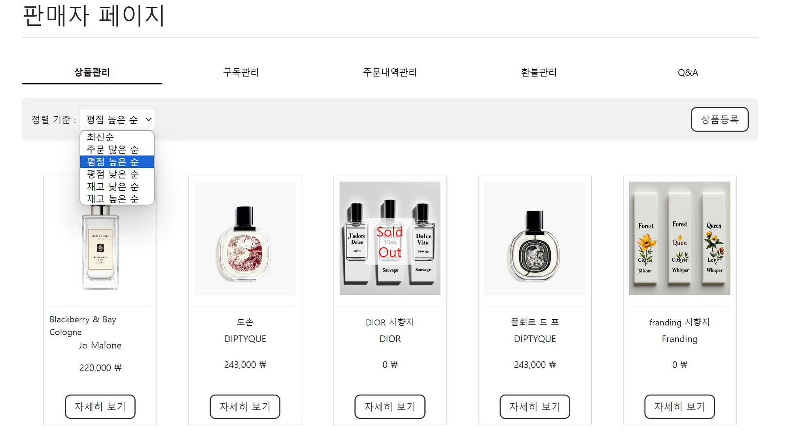
- 판매자 페이지 -> 상품 관리 -> 상품 세부 page
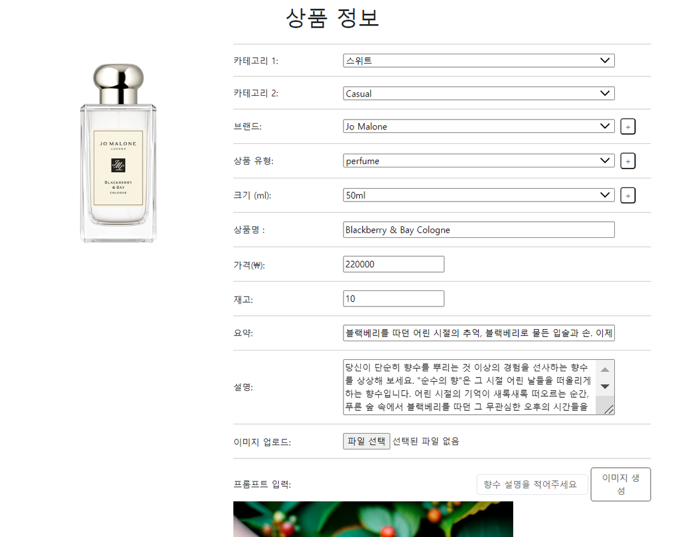
- 판매자 페이지 -> 리뷰 관리
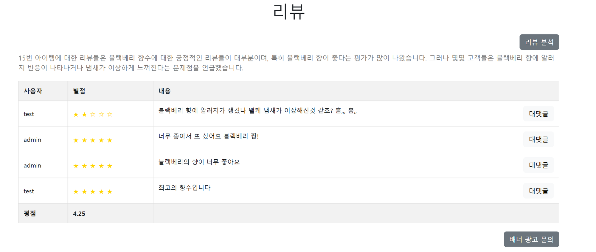
- 판매자 페이지 -> 구독 관리
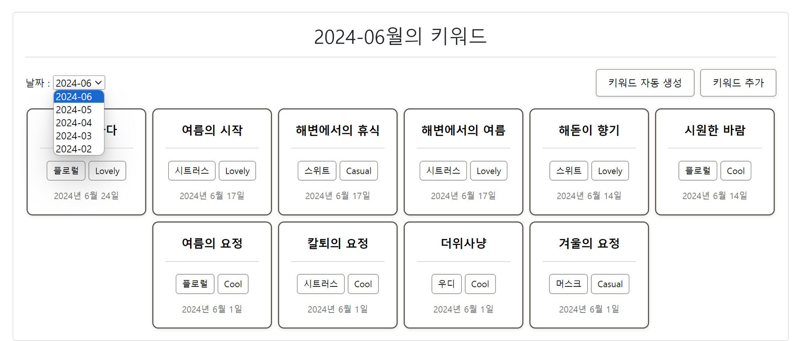
- 판매자 페이지 -> 구독 관리 -> 구독 키워드
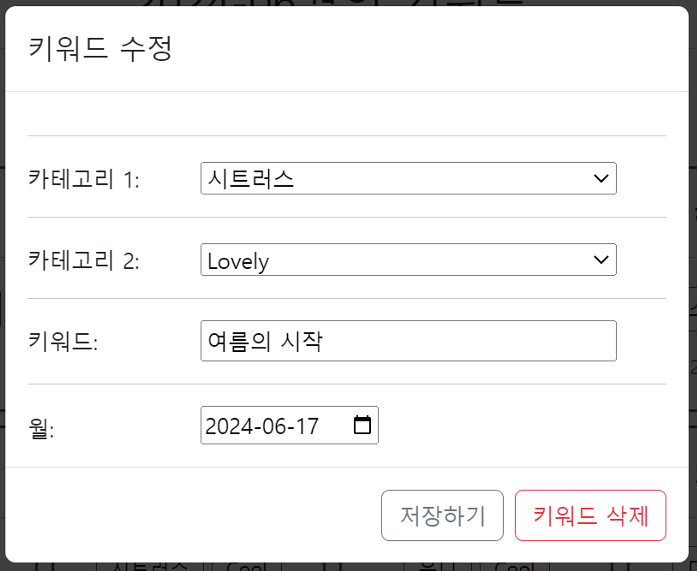
- 판매자 페이지 -> 구독 관리 -> 구독 고객 관리
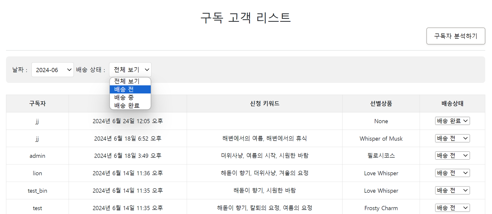
- 판매자 페이지 -> 구독 관리 -> 구독자 분석
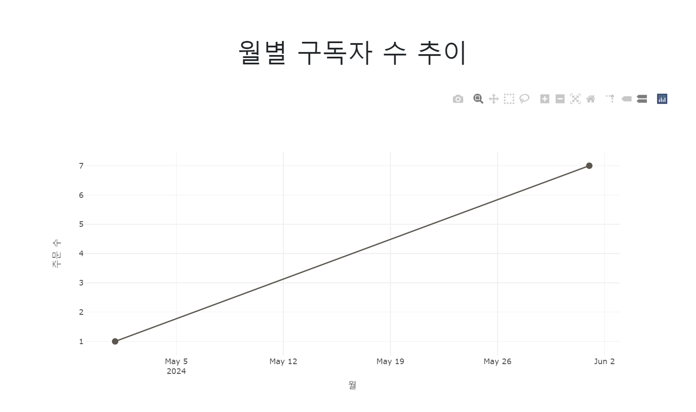
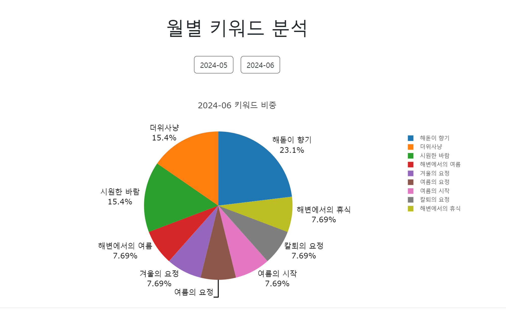
- 판매자 페이지 -> 주문 내역 관리 -> 배송 상태 관리
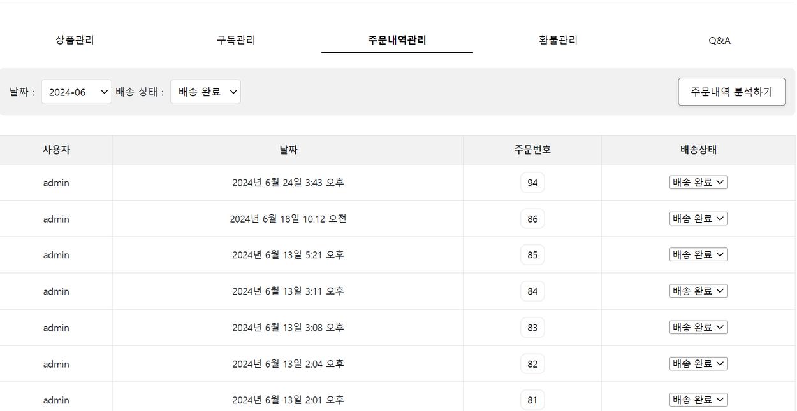
- 판매자 페이지 -> 주문 내역 관리 -> 배송 상태 관리 -> 주문 상세
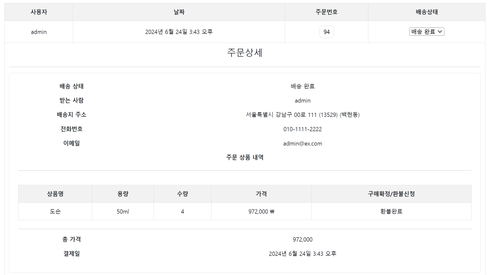
- 판매자 페이지 -> 환불 관리
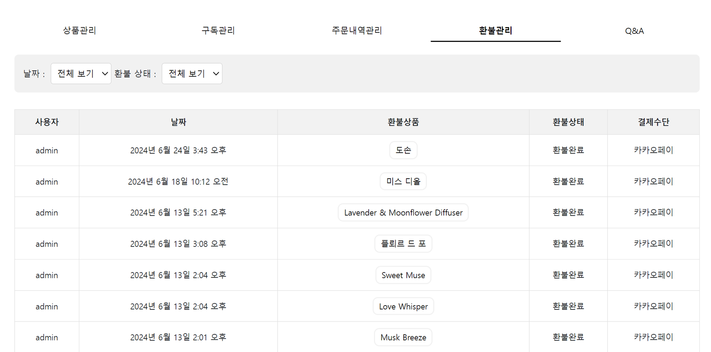
- chatbot
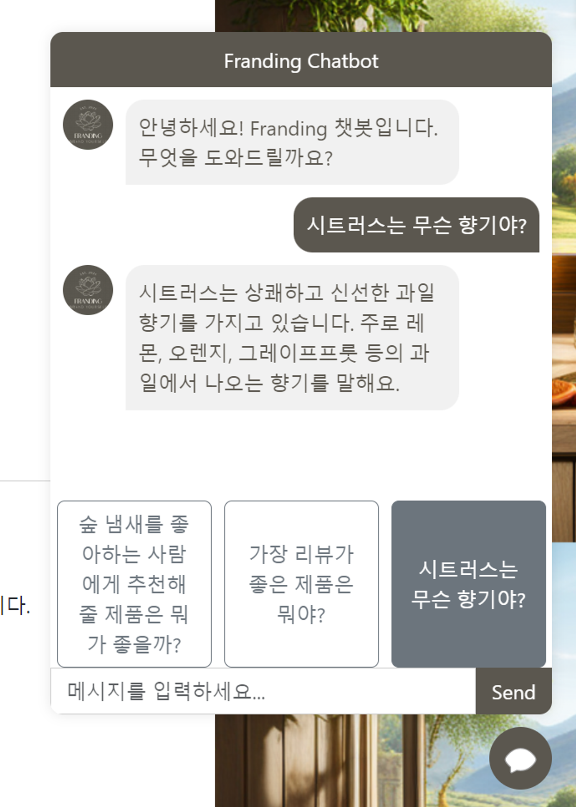
- 상품 상세 페이지
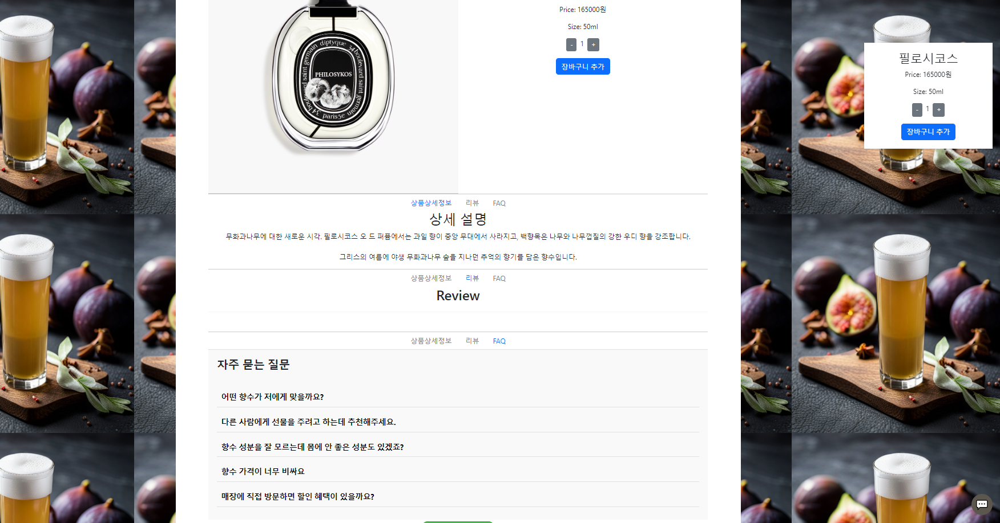
- 가이드 페이지
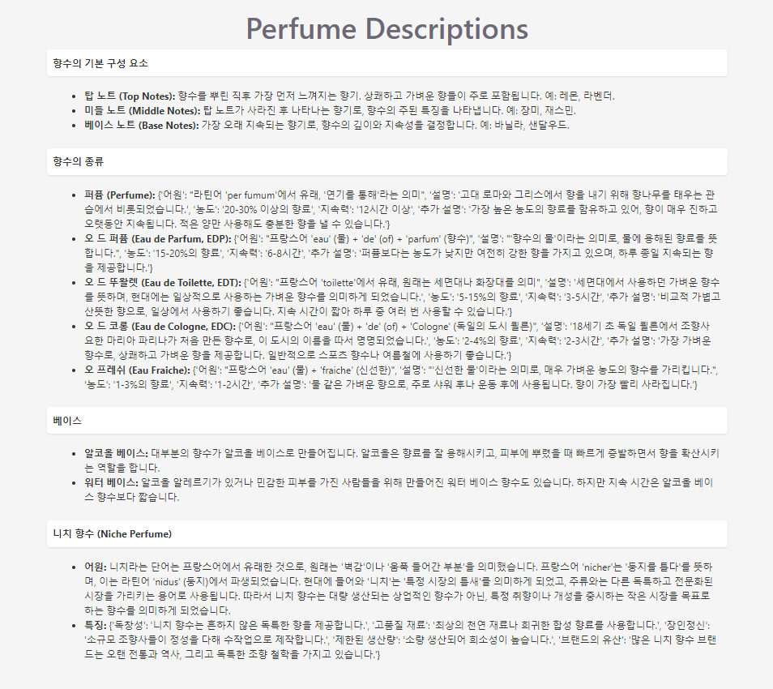
- 쿠폰
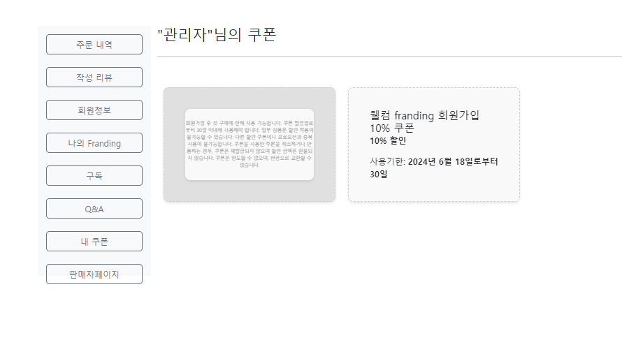
- 구독
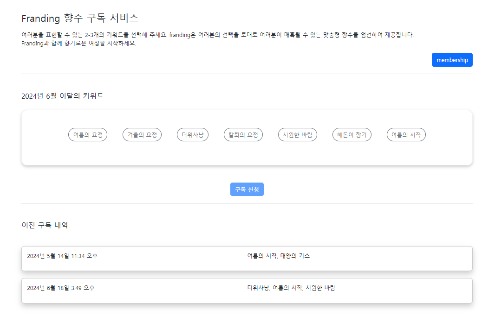