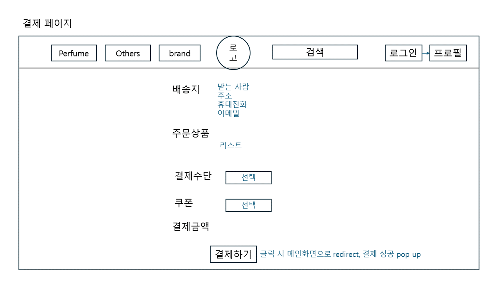
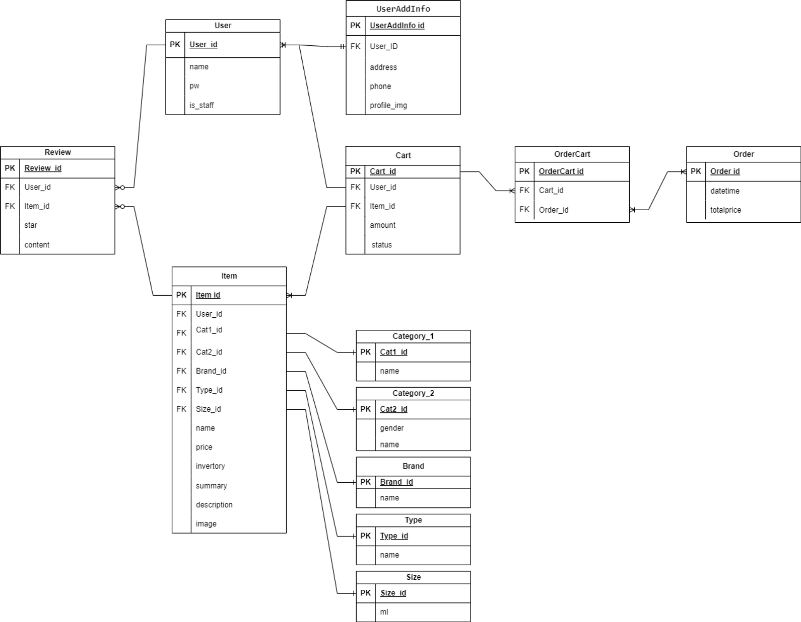

##### 결제 페이지

##### 데이터베이스

##### 결제 정보 입력
---------------------------
##### 결제 정보를 서버로 전송

- 모델 생성: 결제 정보를 저장할 모델을 생성합니다. 이 모델은 결제 금액, 결제 상태, 사용자 정보, 결제 방법 등의 필드를 포함할 수 있습니다.

- API 엔드포인트 생성: 결제를 생성, 조회, 업데이트, 삭제(CRUD)할 수 있는 API 엔드포인트를 생성합니다. Django REST Framework에서는 이를 위해 APIView 또는 ViewSet 클래스를 사용할 수 있습니다.

- 직렬화 클래스 생성: 클라이언트와 서버 간에 데이터를 교환할 때 사용할 직렬화 클래스를 생성합니다. 이 클래스는 결제 모델의 데이터를 JSON 형식으로 변환하거나, JSON 데이터를 결제 모델의 인스턴스로 변환하는 역할을 합니다.

- 결제 처리 로직 구현: 결제를 처리하는 로직을 구현합니다. 이 로직은 결제 정보를 결제 시스템에 전송하고, 결제 시스템의 응답을 처리하는 역할을 합니다.

- 결제 폼 생성: 사용자로부터 결제 정보를 수집하는 결제 폼을 생성합니다. 이 폼은 클라이언트 사이드에서 렌더링되며, 사용자가 폼을 제출하면 결제 정보가 서버로 전송됩니다.

- 결제 완료 페이지 생성: 결제가 완료된 후 사용자를 리디렉션할 결제 완료 페이지를 생성합니다. 이 페이지에서는 결제 결과를 사용자에게 보여주고, 추가적인 작업(예: 배송 정보 확인, 결제 취소 등)을 수행할 수 있습니다.

- 유닛 테스트 작성: 결제 기능의 유닛 테스트를 작성합니다. 이 테스트는 결제 API 엔드포인트와 결제 처리 로직이 올바르게 작동하는지 확인하는 데 사용됩니다.

-----------------------------
##### 서버에서 결제 처리
##### 결제 결과를 클라이언트로 전송

# 쿠폰이라는 정체가 되게 애매함.
# 사람이 쿠폰을 가져옴.